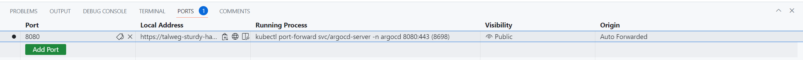
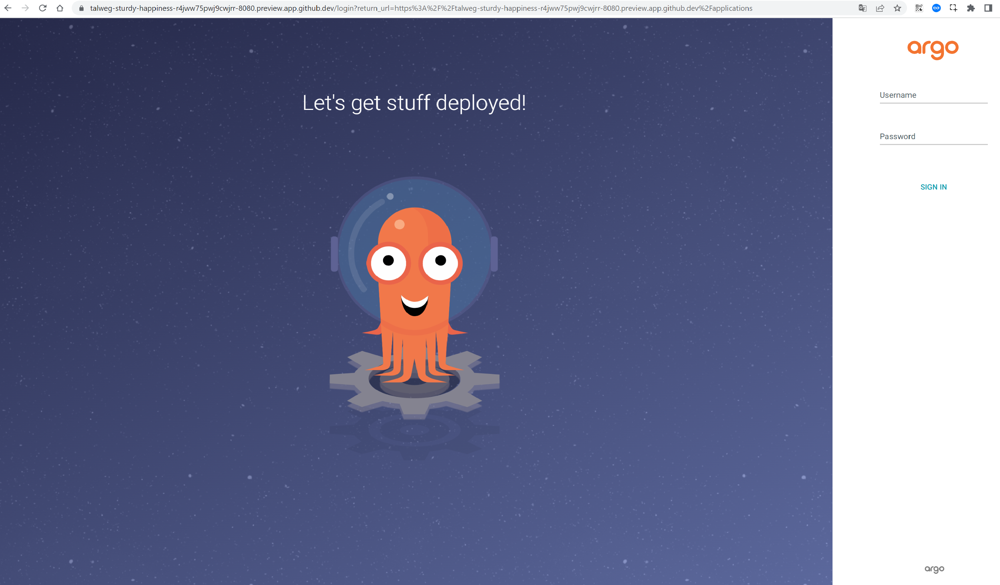
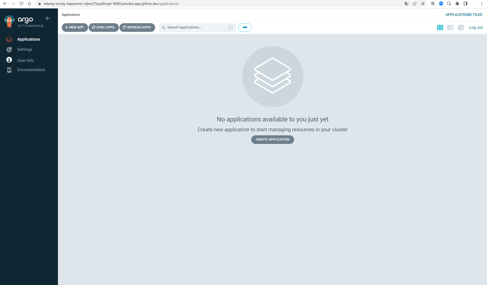

Instruction to get access to AgroCD interface.
1.	Open/Create GitHub Codespace for repo https://github.com/talweg/AsciiArtify
2.	Install k3d:
```bash 
$ curl -s https://raw.githubusercontent.com/k3d-io/k3d/main/install.sh | bash
```
3.	Create cluster:
```bash 
$ k3d cluster create k3d-demo
```
4.	Install Agro CD:
```bash 
$ kubectl create namespace argocd
$ kubectl apply -n argocd -f https://raw.githubusercontent.com/argoproj/argo-cd/stable/manifests/install.yaml
```
5.	Download Argo CD CLI:<br />
 ```bash
$ curl -sSL -o argocd-linux-amd64 https://github.com/argoproj/argo-cd/releases/latest/download/argocd-linux-amd64 <br />
$ sudo install -m 555 argocd-linux-amd64 /usr/local/bin/argocd <br />
$ rm argocd-linux-amd64
 ```
6.	Setup access to Argo CD server:
```bash
$ kubectl port-forward svc/argocd-server -n argocd 8080:443
``` 
 (in the Codespace’s tab 'Ports' set 'https' and 'Public' for port 8080)
7.	Open link (local address) from Codespace's tab 'Ports' in the browser.

8.	Login page:

9. Get admin password via ArgoCD CLI:
```bash 
 argocd admin initial-password -n argocd
```
10. After logging in with login *admin* password: *received administrator password*  interface:

